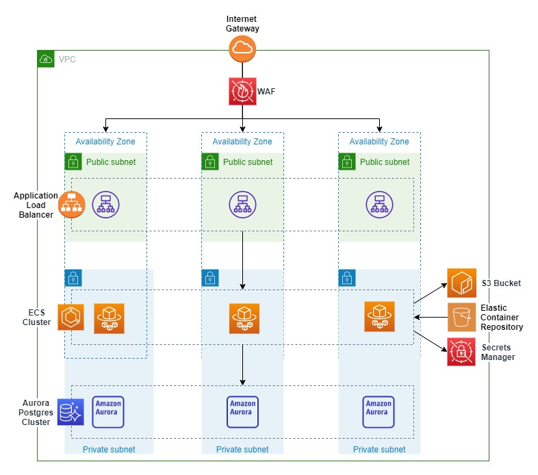

# CDK Metadata parser

This is a simple example to demonstrate the use of the Amazon Cloud Development Kit (CDK) in generating a serverless Fargate service that utilises
an S3 bucket and Aurora Postgres server for storage. The application allows users to upload videos and pictures, generates metadata on the media,
and displays it back. The database secrets are secured through AWS secrets manager and the role to access the credentials restricted to the running container.

