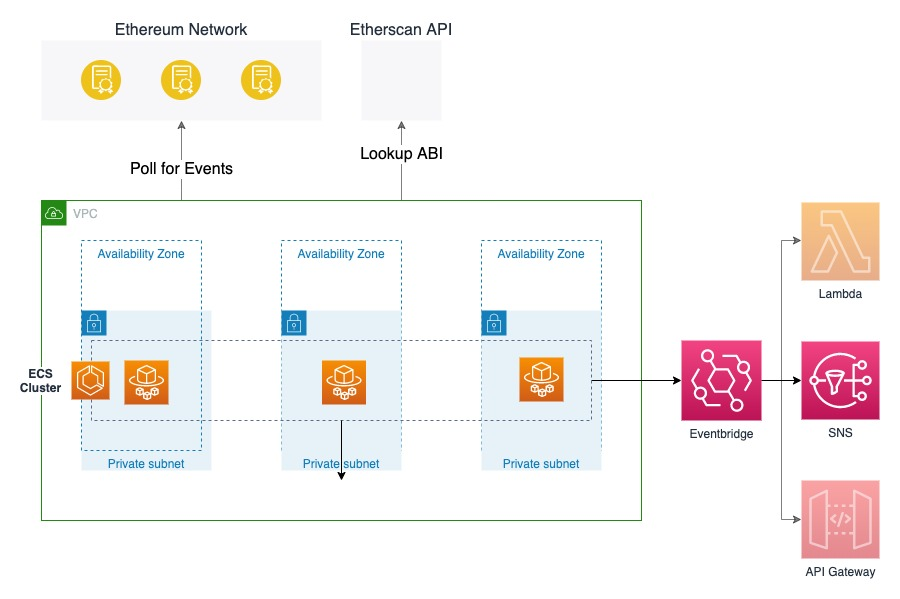

# Relaying Ethereum contract events into AWS using Fargate and EventBridge


  

## Introduction

The CDK application app.py will create the cloud stack and fargate services to poll
ethereum contract events. Connection to the ethereum network is made through a 
Web3 HttpProvider given by the <node_url> variable, with <contract_addresses> for 
contract names and addresses to be passed to each individual service
In this demo, the connection is to the Infura node endpoints,
see https://blog.infura.io/getting-started-with-infura-28e41844cc89/
Events are monitored for the NFT contracts CryptoPunks, MeeBits,
and MutantApeYachtClub.

## Walkthrough

## Appendix

This is a blank project for Python development with CDK.

The `cdk.json` file tells the CDK Toolkit how to execute your app.

This project is set up like a standard Python project.  The initialization
process also creates a virtualenv within this project, stored under the .env
directory.  To create the virtualenv it assumes that there is a `python3`
(or `python` for Windows) executable in your path with access to the `venv`
package. If for any reason the automatic creation of the virtualenv fails,
you can create the virtualenv manually.

To manually create a virtualenv on MacOS and Linux:

```
$ python3 -m venv .env
```

After the init process completes and the virtualenv is created, you can use the following
step to activate your virtualenv.

```
$ source .env/bin/activate
```

If you are a Windows platform, you would activate the virtualenv like this:

```
% .env\Scripts\activate.bat
```

Once the virtualenv is activated, you can install the required dependencies.

```
$ pip install -r requirements.txt
```

At this point you can now synthesize the CloudFormation template for this code.

```
$ cdk synth
```

To add additional dependencies, for example other CDK libraries, just add
them to your `setup.py` file and rerun the `pip install -r requirements.txt`
command.

# Useful commands

 * `cdk ls`          list all stacks in the app
 * `cdk synth`       emits the synthesized CloudFormation template
 * `cdk deploy`      deploy this stack to your default AWS account/region
 * `cdk diff`        compare deployed stack with current state
 * `cdk docs`        open CDK documentation

Enjoy!
